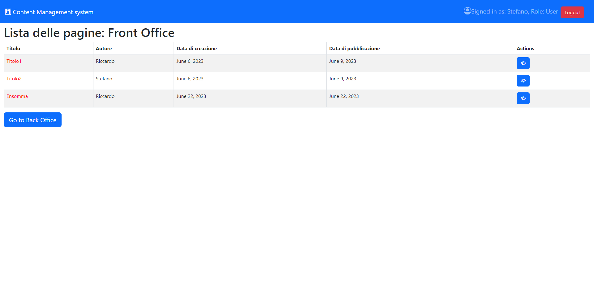
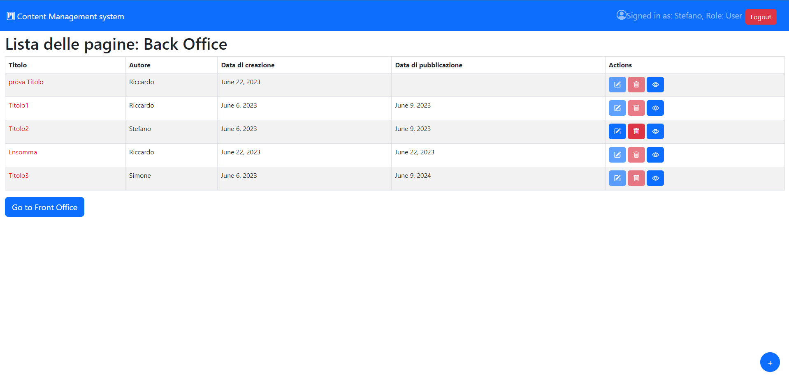
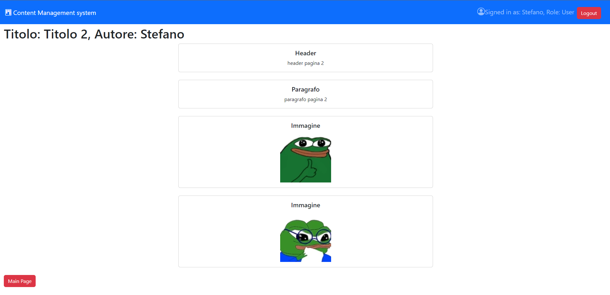
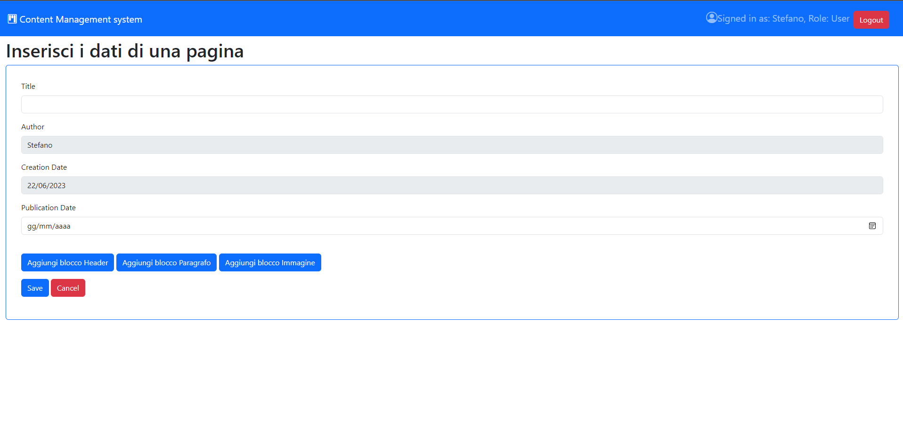

[](https://classroom.github.com/a/suhcjUE-)
# Exam #1: "CMSmall"
## Student: s319441 Cardona Riccardo 

## React Client Application Routes

- Route `/`: FrontOffice, where the not logged user can see the published page
- Route `/backOffice`: BackOffice, where the logged user can select a page to modify or directly delete it.
- Route `/add`: AddLayout, form layout where the user can write the characteristics of the page and add its blocks.
- Route `/edit/:pageId`: EditLayout, form layout where the user can modify the characteristics of the page and its blocks. The pageId is the id of the selected page to modify.
- Route `/components/:pageId`: ComponentList, layout that displays the list of page blocks. The pageId is the id of the selected page to display.
- Route `/login`: LoginForm, form layout for the login of the user.
- Route `*`: NotFoundLayout

## API Server

- GET `/api/pages`
  - Description: returns the list of pages that have the status 'published' i.e. the date is before today's date (for unauthenticated users)
  - Request body: _None_
  - Response: `200 OK` (success) or `503 Database error` (generic error).
  - Response body: An array of objects, each describing a page. This object has for each page the description of the author and the complete list of blocks (Content-Type: `application/json`).
  ``` JSON
  [{
      "id": 1,
      "title": "Titolo1",
      "creationDate": "2023-06-06",
      "publicationDate": "2023-06-09",
      "user": {
          "id": 1,
          "name": "Riccardo",
          "admin": 1
      },
      "blocks": [
          {
            "id": 1,
            "blockType": "Header",
            "content": "Header pagina 1",
            "order": 1
          },  
          ...
      ]
      ...
    }
  ]
  ```

- GET `/api/pages/<id>`
  - Description: Get the page identified by the id `<id>`. The user must be logged in.
  - Request body: _None_
  - Response: `200 OK` (success), `404 Not Found` (wrong id), `422 Unprocessable Entyty` (validation error) or `503 Database error` (generic error).
  - Response body: An object, describing a sigle page (Content-Type: `application/json`).
  ``` JSON
  {
      "id": 1,
      "title": "Titolo1",
      "creationDate": "2023-06-06",
      "publicationDate": "2023-06-22",
      "user": {
          "id": 1,
          "name": "Riccardo",
          "admin": 1
      },
      "blocks": [
          {
            "id": 57,
            "blockType": "Header",
            "content": "Header pagina 1",
            "order": 1
          },
          ...
      ]
  }
  ```
  
- POST `/api/pages`
  - Description: create a new page for the logged-in user and also all of its blocks providing all the necessary information. The user must be logged in.
  - Request body: an object representing a page (Content-Type: `application/json`).
  ``` JSON
  {
    "title": "prova",
    "creationDate": "2023-06-13",
    "publicationDate": "2023-06-13",
    "blocks": [
        {
            "blockType": "Header",
            "content": "prova Header",
            "order": 1
        },
        {
            "blockType": "Paragrafo",
            "content":  "prova paragrafo",
            "order": 2
        }
    ]
  }
  ```
  - Response: `200 OK` (success) or `503 Database Error` (generic error). If the request body is not valid, `422 Unprocessable Entyty` (validation error)
  - Response body: An object representing the new page with the new assigned id by the database (Content-Type: `application/json`). 
  ``` JSON
  {
    "id": 5,
    "title": "prova",
    "creationDate": "2023-06-13",
    "publicationDate": "2023-06-13",
    "user": {
        "id": 1,
        "name": "Riccardo",
        "admin": 1
    },
    "blocks": [
      {
        "id": 65,
        "blockType": "Header",
        "content": "prova header",
        "order": 1
      },
      {
        "id": 66,
        "blockType": "Paragrafo",
        "content": "prova paragrafo",
        "order": 2
      } 
    ]
  }
  ```
  
- PUT `/api/pages/<id>`
  - Description: update entirely an existing page, identified by its id. The user must be logged in.
  - Request Body: an object representing the entire page. If the logged user is an admin, he can also modify the author of a page. (Content-Type: `application/json`).
  ``` JSON
  {
    "id": 3,
    "title": "prova modifica",
    "authorId": 2,
    "creationDate": "2023-06-13",
    "publicationDate": "2023-06-13",
    "blocks": [
        {
          "blockType": "Header",
          "content": "prova header modifica",
          "order": 1
        },
        {
          "blockType": "Paragrafo",
          "content": "prova paragrafo modifica",
          "order": 2
        }
    ]
  }
  ```
  - Response: `200 OK` (success), `404 Not Found` (wrong id), `503 Database Error` (generic error). If the request body is not valid, `422 Unprocessable Entyty` (validation error)
  - Response Body: An object describing the updated page (Content-Type: `application/json`).
  ``` JSON
  {
    "id": 3,
    "title": "prova modifica",
    "creationDate": "2023-06-06",
    "publicationDate": "2023-06-13",
    "user": {
    "id": 2,
    "name": "Stefano",
    "admin": 0
    },
    "blocks": [
       {
         "id": 69,
         "blockType": "Header",
         "content": "prova header modifica",
         "order": 1
       },
       {
       "id": 70,
       "blockType": "Paragrafo",
       "content": "prova paragrafo modifica",
       "order": 2 
       }
    ]
  }
  ```

- DELETE `/api/pages/<id>`
  - Description: Delete an existing page of the logged user including all its blocks.
  - Request body: _None_
  - Response: `200 OK` (success), `404 Not Found` (wrong id), `503 Database Error` (generic error). If the request is not valid (delete an unowned page) `422 Unprocessable Entyty` (validation error).
  - Response Body: _None_

- GET `/api/images`
  - Description: return the full list of images (the url)
  - Request body: _None_
  - Response: `200 OK` (success) or `503 Database Error` (generic error).
  - Response Body: An array oj object representing the url an image (Content-Type: `application/json`).
  ``` JSON
  [
    {
      "url": "http://localhost:3001/images/chatting.webp"
    },
    {
      "url": "http://localhost:3001/images/ok.webp"
    },
    ...
  ]
  ```
  
- GET `api/title`
  - Description: return the title of the web page set by an admin
  - Request Body: _None_
  - Response: `200 OK` (success) or `503 Database Error` (generic error).
  - Response Body: the object representing the title of the page (Content-Type: `application/json`).
  ``` JSON
    {
      "title": "Content Management system"
    }
  ```
  
- PUT `/api/title`
  - Description: change the title of the web page only if the authenticated user is an admin.
  - Request Body: an object representing the title (Content-Type: `application/json`).
  ``` JSON
    {
      "title": "Content Management system"
    }
  ```
  - Response: `200 OK` (success) or `503 Database Error` (generic error). If the request is not valid (the user is not admin) `422 Unprocessable Entyty` (validation error).
  - Response Body: _None_

- POST `/api/sessions`
  - Description: Api for the login. It returns the full list of pages for the authenticated users.
  - Request Body: An object representing the user (username + password) (Content-Type: `application/json`).
  ``` JSON
    {
      "username": "riccardo@test.com",
      "password": "prova"
    }
  ```
  - Response: `200 OK` (success), `422 Unprocessable Entyty` (validation error) or `503 Database Error` (generic error).
  - Response Body: An array of objects, each describing a page. This object has for each page the description of the author and the complete list of blocks (Content-Type: `application/json`).
  ``` JSON
  {
    "id": 1,
    "name": "Riccardo",
    "email": "riccardo@test.com",
    "admin": 1,
    "pagine": [
      {
        "id": 3,
        "title": "Titolo3",
        "creationDate": "2023-06-06",
        "publicationDate": "2024-06-09",
        "user": {
          "id": 3,
          "name": "Simone",
          "admin": 1
        },
        "blocks": [
          {
            "id": 5,
            "blockType": "Header",
            "content": "header pagina 3",
            "order": 1
          },
          {
            "id": 6,
            "blockType": "Immagine",
            "content": "http://localhost:3001/images/ok.webp",
            "order": 2
          }
          ...
        ]
      }
      ...
    ]
  }
  ```

- GET `/api/sessions/current`
  - Description: Check if the user is logged. In case of a positive answer, return the title of the web page set by an admin.
  - Request Body: _None_
  - Response: `200 OK` (success), `401 Unauthorized` or `503 Database Error` (generic error).
  - Response Body: If the user is logged it an array of objects, each describing a page. This object has for each page the description of the author and the complete list of blocks (Content-Type: `application/json`).
  ``` JSON
  {
    "id": 1,
    "name": "Riccardo",
    "email": "riccardo@test.com",
    "admin": 1,
    "pagine": [
      {
        "id": 3,
        "title": "Titolo3",
        "creationDate": "2023-06-06",
        "publicationDate": "2024-06-09",
        "user": {
          "id": 3,
          "name": "Simone",
          "admin": 1
        },
        "blocks": [
          {
            "id": 5,
            "blockType": "Header",
            "content": "header pagina 3",
            "order": 1
          },
          {
            "id": 6,
            "blockType": "Immagine",
            "content": "http://localhost:3001/images/ok.webp",
            "order": 2
          }
          ...
        ]
      }
      ...
    ]
  }
  ```
  
- DELETE `api/sessions/current`
  - Description: delete the user from the session
  - Request Body: _None_
  - Response: `200 OK` (success) or `503 Database Error` (generic error).
  - Response Body: _None_

- GET `api/sessions/current`
  - Description: return the full list of users (just the name and the id) if the user is logged and it's an admin.
  - Request Body: _None_
  - Response: `200 OK` (success), `422 Unprocessable Entyty` (validation error) or `503 Database Error` (generic error).
  - Response Body: An array of objects, each describing a user (Content-Type: `application/json`).
  ``` JSON
  [
    {
      "name": "Riccardo",
      "id": 1
    },
    {
      "name": "Stefano",
      "id": 2
    },
    {
      "name": "Simone",
      "id": 3
    },
    {
      "name": "Lorenzo",
      "id": 4
    },
    {
      "name": "Chiara",
      "id": 5
    }
  ]  
  ```

## Database Tables

- Table `users`  - id, email, name, salt, password, admin
- Table `pages`  - id, authorId, title, creationDate, publicationDate
- Table `blocks` - id, blockType, pageId, content, order
- Table `images` - id, url
- Table `title`  - title


## Main React Components

- `pages` (in `App.jsx`): An array of objects, each describing a page. It's used to display the pages in the page
- `user` (in `App.jsx`): An object that describe the logged user. 
- `dirty` (in `App.jsx`): A boolean that indicates whether the client data is synchronized with the server (dirty=false) or not (dirty=true). As soon as it becomes false after a user change of data, the client will ask the server for the updated data.
- `title` (in `App.jsx`): A string that represent the title of the web page.
- `loadig` (in `App.jsx`): A boolean that indicates whether the data has arrived at the client after its request (loading=false) or not (loading=true).

## Screenshot

- Back Office


- Front Office


- Page View


- Page Form


## Users Credentials

* username: riccardo@test.com, password: "prova"
* username: stefano@test.com, password: "prova"
* username: simone@test.com, password: "prova"
* username: lorenzo@test.com, password: "prova"
* username: chiara@test.com, password: "prova"


